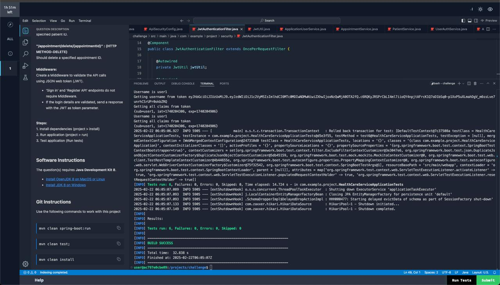

## Healthcare Service - Spring Boot

**HealthCare Service - SpringBoot Backend**

Create an API for Healthcare Service.

### Submission Report
 
 

### API Endpoints

#### register (HTTP METHOD - POST)

- Should register a user.
- On successful registration, the response should be `{message="Registration successful"}`.
- On registration failure, the response should be `{message="Password or username policy failed"}`.

#### signin (HTTP METHOD - POST)

- A user should be able to sign in through this endpoint by providing their **email** and **password**.
- On successful login, the response should be:
  ```
  {
    message = "Authentication successful!",
    token = JWTtoken,
    id = user.Id
  }
  ```
- On login failure, the response should be `{message="Username or Password is Incorrect."}`.

#### "viewprofile/{userId}" (HTTP METHOD - GET)

- Should return the details of all users.

#### "editprofile/{userId}" (HTTP METHOD - GET)

- Should allow you to edit a user's profile.

#### "patients/register" (HTTP METHOD - POST)

- A user should be able to register a patient through this API.
- On successful registration, the response should be `{message="Registration successful"}`.
- On registration failure, the response should be `{message="Registration failure"}`.

#### "patients/list/" (HTTP METHOD - GET)

- Should return the list of all patients.

#### "patients/view/{Id}" (HTTP METHOD - GET)

- Should return details of a specified patient ID.

#### "patients/delete/{Id}" (HTTP METHOD - DELETE)

- Should delete a specified patient ID.

#### "appointment/register" (HTTP METHOD - POST)

- Should book an appointment.
- On successful booking, the response should be `{message="Booking successful"}`.
- On booking failure, the response should be `{message="Booking failure"}`.

#### "appointment/list" (HTTP METHOD - GET)

- Should return the list of all appointments.

#### "/appointment/view/{appointmentId}" (HTTP METHOD - GET)

- Should return details of a specified appointment ID.

#### "/appointment/list/{patientid}" (HTTP METHOD - GET)

- Should return the list of all the appointments of a specified patient ID.

#### "/appointment/delete/{appointmentId}" (HTTP METHOD - DELETE)

- Should delete a specified appointment ID.

### Middleware

Create a Middleware to validate the API calls using JSON web token (JWT).

- 'Sign in' and 'Register API' endpoints do not require Middleware.
- If the login details are validated, send a response with the JWT as token parameter.

### Steps

1. Install dependencies (project > install)
2. Run application (project > run)
3. Test application (Run tests)

---

## Software Instructions

The question(s) requires **Java Development Kit 8**.

- [Install OpenJDK 8 on MacOS or Linux](https://openjdk.java.net/install/)
- [Install JDK 8 on Windows](https://www.oracle.com/technetwork/java/javase/downloads/jdk8-downloads-2133151.html)

---

## Git Instructions

Use the following commands to work with this project:

```bash
mvn clean spring-boot:run
```

```bash
mvn clean test;
```

```bash
mvn clean install
```
